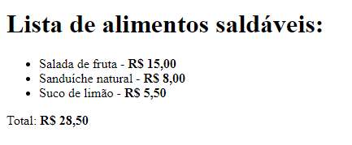
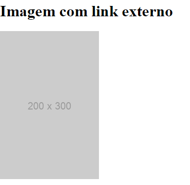
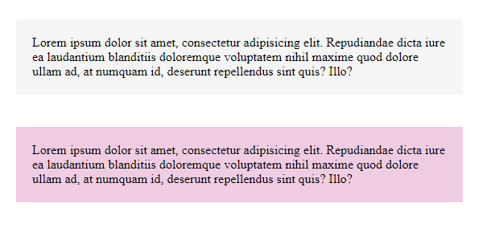
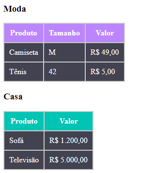

# EXERCÍCIOS HTML E CSS BÁSICO

## Índice

- [Overview](#overview)
  - [Print do exercicio pronto](#print-do-exercico-pronto)
  - [Links](#links)
- [Meu processo](#meu-processo)
  - [Construído com](#construído-com)
  - [O que aprendi](#o-que-aprendi)
- [Autor](#autor)
- [Agradecimento](#agradecimento)

## Overview

### Print do exercicio pronto
#### EXERCÍCIO 1:


#### CÓDIGO UTILIZADO

```html
<body>

    <h1>Lista de alimentos saldáveis:</h1>

    <ul>
        <li>Salada de fruta - <strong>R$ 15,00</strong></li>
        <li>Sanduíche natural - <strong>R$ 8,00</strong></li>
        <li>Suco de limão - <strong>R$ 5,50</strong></li>
    </ul>
    <p>Total: <strong>R$ 28,50</strong></p>
</body>
```
#### EXERCÍCIO 2:


#### CÓDIGO UTILIZADO

```html
<body>
    <h1>Imagem com link externo</h1>
    <a href=" https://google.com" target="_blank"></a>
</body>
```
#### EXERCÍCIO 3:



#### CÓDIGOS UTILIZADOS
```html
<body>
    <p class="padrao">Lorem ipsum dolor sit amet, consectetur adipisicing elit. Repudiandae dicta iure ea laudantium blanditiis doloremque voluptatem nihil maxime quod dolore ullam ad, at numquam id, deserunt repellendus sint quis? Illo?</p>
    <p class="destacado">Lorem ipsum dolor sit amet, consectetur adipisicing elit. Repudiandae dicta iure ea laudantium blanditiis doloremque voluptatem nihil maxime quod dolore ullam ad, at numquam id, deserunt repellendus sint quis? Illo?</p>
</body>
```
```css
p {
    margin: 40px;
    padding: 20px;
}
.padrao {
    background-color: #f5f5f5;
}

.destacado {
    background-color: #f0cce2;
}
```
#### DESAFIO



#### CÓDIGOS UTILIZADOS
```html
<body>
    <h3>Moda</h3>
    <table class="tabela">
        <thead class="cabecalho-moda">
            <tr>
                <td>Produto</td>
                <td>Tamanho</td>
                <td>Valor</td>
            </tr>
        </thead>
        <tbody>
            <tr>
                <td>Camiseta</td>
                <td>M</td>
                <td>R$ 49,00</td>
            </tr>
            <tr>
                <td>Tênis</td>
                <td>42</td>
                <td>R$ 5,00</td>
            </tr>
        </tbody>
    </table>
    <h3>Casa</h3>
    <table class="tabela">
        <thead class="cabecalho-casa">
            <tr>
                <td>Produto</td>
                <td>Valor</td>
            </tr>
        </thead>
        <tbody>
            <tr>
                <td>Sofá</td>
                <td>R$ 1.200,00</td>
            </tr>
            <tr>
                <td>Televisão</td>
                <td>R$ 5.000,00</td>
            </tr>
        </tbody>
    </table>
    
</body>
```
```css
html {
    box-sizing: border-box;
}

.tabela {
    background-color: #ccc;
    color: #fff;
}

.tabela tr td {
    margin: 10px;
    padding: 10px;
    background-color: #424250;
}

.tabela .cabecalho-moda tr td{
    margin: 10px;
    padding: 10px;
    background-color: #bb86fc;
    font-weight: 700;
    text-align: center;
}

.tabela .cabecalho-casa tr td {
    background-color: #00c4b4;
    margin: 10px;
    padding: 10px;
    font-weight: 700;
    text-align: center;
}
```

### Links

- URL da solução: [Repositório](https://github.com/maiarasteffen/exercico-html-css-basico)

## Meu Processo

### Construído com

- Marcação HTML5 semântica
- Propriedades personalizadas do CSS


### O que aprendi

Aprendizado de tags HTML básico como: listas, paragrafos, tabelas. E CSS básico como: margin, padding, color, box-sizing.


## Autor

- LinkedIn - [@maiarasteffen](https://www.linkedin.com/in/maiara-steffen/)
- Instagram - [@maiara_steffen](https://www.instagram.com/maiara_steffen/)


## Agradecimento

Quero agradecer muito ao [Dev em dobro](https://www.instagram.com/devemdobro/) que me ajudou em suas lives e cursos a mostrar a forma mais simplificada e funcional para codar.
